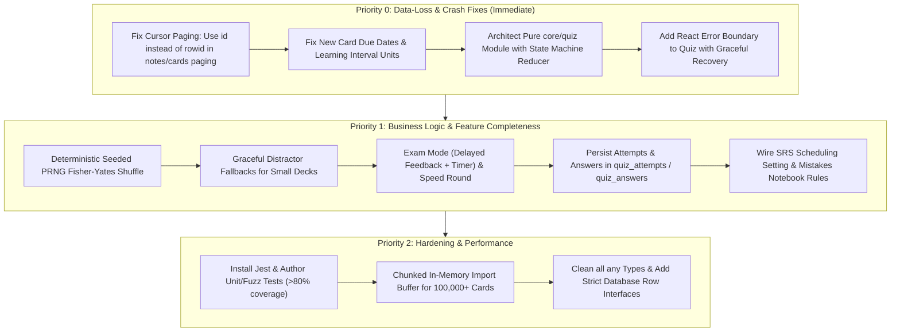

# AUDIT REPORT — Flash Cards App (Offline AnkiDroid-like)

> **Document Version:** 1.0.0  
> **Date:** October 3, 2026  
> **Status:** Phase 0 Completed (Read-Only Audit & Reproduction)  
> **Author:** Senior React Native & QA Lead  

---

## 1. PROJECT MAP

### 1.1 Tech Stack & Versions
- **Runtime & Framework:** React Native 0.86.3, Expo SDK ~57.0.0 (Expo Router ~57.0.24, New Architecture enabled).
- **Core Language:** TypeScript ~6.0.3 (Strict mode partially enabled, extensive use of `any` in importer/quiz).
- **Local Database:** `expo-sqlite` ~57.0.3 with SQLite WAL journal mode and foreign keys enabled.
- **State Management:** `zustand` ^4.5.2 (used for UI state; database is primary source of truth).
- **File System & IO:** `expo-file-system/legacy` ~57.0.7, `expo-document-picker` ~57.0.3, `expo-sharing` ~57.0.22.
- **Parsers & Compressions:** `xlsx` 0.20.3 (SheetJS), `papaparse` ^5.4.1, `jszip` ^3.10.1, `pako` (for custom streaming inflator), `fzstd` ^0.1.1 (Zstandard decompression).
- **UI & Graphics:** `react-native-safe-area-context` ~5.7.0, `react-native-reanimated` 4.5.1, `react-native-gesture-handler` ~2.32.0, `react-native-svg` 15.15.4, `expo-linear-gradient` ~57.0.2.
- **Media & Audio:** `expo-audio` ~57.0.5, `expo-speech` ~57.0.3, `react-native-webview` 13.16.1.
- **Internationalization:** `i18next` ^23.11.5, `react-i18next` ^14.1.2, `expo-localization` ~57.0.2 with complete Arabic (RTL) and English (LTR) translations.

### 1.2 Folder Structure & Navigation Map
```
Flash Cards/
├── package.json
├── app.json
├── tsconfig.json
├── docs/
│   ├── anki_import_guide.md       # Canonical Anki import specification
│   ├── flashcards_app_spec.md     # Full application product specification
│   └── AUDIT.md                   # This audit document
├── src/
│   ├── app/                       # Expo Router file-based routes
│   │   ├── _layout.tsx            # Root layout, theme provider, DB init
│   │   ├── (tabs)/                # Bottom tabs: Decks, Study, Browser, Quiz, Settings
│   │   │   ├── _layout.tsx
│   │   │   ├── index.tsx          # Home / Decks dashboard
│   │   │   ├── study.tsx          # Study queue & daily limits
│   │   │   ├── browser.tsx        # Card browser & search
│   │   │   ├── quiz.tsx           # Quiz mode selector & mistakes notebook entry
│   │   │   └── settings.tsx       # App settings & preferences
│   │   ├── import/                # Importer wizard (file picker, mapping, execution)
│   │   ├── quiz/                  # Quiz execution screens
│   │   │   ├── play.tsx           # Active quiz gameplay (all modes)
│   │   │   └── results.tsx        # Quiz results, score ring, XP calculation
│   │   ├── study/                 # Study sessions (flip card, podcast, review)
│   │   ├── decks/                 # Deck management & creation
│   │   ├── note-types/            # Template & field editors
│   │   ├── settings/              # Detailed settings sub-screens
│   │   └── tools/                 # Database & media maintenance
│   ├── components/                # Reusable UI & Card components
│   │   ├── ui/                    # Chunky 3D buttons, cards, progress bars, chips
│   │   ├── card/                  # Flashcard flip views, WebView template renderer
│   │   └── common/                # Custom alerts, dialogs
│   ├── core/                      # Pure business logic & database services
│   │   ├── db/                    # SQLite connection, migrations, repositories
│   │   │   ├── migrations/        # 001_initial_schema.ts
│   │   │   └── repositories/      # deckRepository, noteRepository, cardRepository, etc.
│   │   ├── importers/             # apkgImporter, textImporter, xlsxImporter, zipReader, importManager
│   │   ├── quiz/                  # generator, checker, mistakesManager, types
│   │   ├── scheduler/             # SM-2 and FSRS spaced repetition algorithms
│   │   ├── render/                # Anki HTML/CSS template engine & cloze parser
│   │   ├── audio/                 # Audio player & speech service
│   │   └── media/                 # Local media file manager & resolver
│   ├── i18n/                      # Translation bundles (Arabic/English)
│   └── theme/                     # Design tokens & color palettes
```

### 1.3 Database Schema & Migrations
The database uses `expo-sqlite` with WAL mode and `PRAGMA foreign_keys = ON`:
- `schema_migrations` `(version INTEGER PRIMARY KEY, applied_at INTEGER)`
- `decks` `(id PK, parent_id FK, name, description, created_at, updated_at, new_per_day, reviews_per_day, settings_json, archived)`
- `note_types` `(id PK, name, fields_json, templates_json, css, is_cloze, created_at)`
- `note_type_versions` `(id PK, note_type_id FK, snapshot_json, saved_at)`
- `notes` `(id PK, guid UNIQUE, note_type_id FK, fields_json, tags, sort_field, checksum, created_at, updated_at)`
- `cards` `(id PK, note_id FK, deck_id FK, template_ord, state, due, stability, difficulty, elapsed_days, scheduled_days, reps, lapses, ease_factor, interval_days, last_review, suspended, buried_until, flag, bookmarked, created_at, updated_at)`
- `review_logs` `(id PK, card_id FK, deck_id FK, rating, state_before, due_before, interval_before, interval_after, duration_ms, reviewed_at)`
- `media` `(id PK, filename UNIQUE, mime, size, hash)`
- `note_media` `(note_id FK, media_id FK, PRIMARY KEY(note_id, media_id))`
- `schedules` `(id PK, deck_id FK, type, time_of_day, days_of_week_mask, duration_min, enabled, notification_id, created_at)`
- `study_sessions` `(id PK, deck_id FK, mode, started_at, ended_at, cards_seen, new_count, review_count, correct_count)`
- `daily_stats` `(date, deck_id, new_done, reviews_done, time_ms, goal_met, PRIMARY KEY(date, deck_id))`
- `settings` `(key PK, value)`
- `import_history` `(id PK, source_type, filename, imported_at, notes_added, notes_skipped, errors_json)`
- `quiz_presets` `(id PK, name, config_json, created_at)`
- `quiz_attempts` `(id PK, preset_id FK, mode, started_at, ended_at, total, correct, score, duration_ms, config_json)`
- `quiz_answers` `(id PK, attempt_id FK, card_id FK, question_type, user_answer, correct_answer, is_correct, time_ms, answered_at)`
- `mistakes` `(card_id PK FK, wrong_count, correct_streak, last_wrong_at)`
- `xp_log` `(id PK, source, amount, created_at)`
- `achievements` `(id PK, key UNIQUE, unlocked_at)`
- `quests` `(id PK, date, key, progress, target, claimed)`

---

## 2. IMPORT AUDIT

### 2.1 The Complete Pipeline Trace
1. **File Selection (`src/app/import/index.tsx:94-147`):**
   - User invokes `DocumentPicker.getDocumentAsync`.
   - On Android, `copyToCacheDirectory: false` returns a `content://` URI (bypassing Expo Go's security scoping violation).
   - If URI is `content://`, it is staged natively via `FileSystem.copyAsync` into `FileSystem.cacheDirectory`.
2. **ZIP Decompression & Inspection (`src/core/importers/zipReader.ts:501-562` & `src/core/importers/apkgImporter.ts:131-169`):**
   - `openZipArchive` scans EOCD at the tail of the archive and constructs an entry map without loading the 200MB+ file into memory.
   - Detects collection database file: `collection.anki21b` (Latest, zstd) vs `collection.anki21` (Legacy 2, SQLite) vs `collection.anki2` (Legacy 1, SQLite).
3. **Database Extraction (`src/core/importers/apkgImporter.ts:50-63` & `185-196`):**
   - Extracts SQLite database to a temporary location in `FileSystem.cacheDirectory` and opens it via `SQLite.openDatabaseAsync`.
4. **Metadata & Schema Reading (`src/core/importers/apkgImporter.ts:363-440`):**
   - Reads `col` table (`crt`, `models`, `decks`, `dconf`, `ver`). If schema v18 (`anki21b`), parses side tables (`notetypes`, `fields`, `templates`, `decks`) and decodes Protobuf BLOBs.
5. **Paged Extraction of Notes & Cards (`src/core/importers/apkgImporter.ts:532-680`):**
   - Reads notes in chunks of 1000 using cursor pagination.
   - Reads cards in chunks of 1000 using cursor pagination.
   - Maps fields using `\x1f` delimiter.
6. **Media Extraction (`src/core/importers/apkgImporter.ts:721-829`):**
   - Reads `media` entry (JSON mapping integer strings to filenames).
   - Unpacks entries, checks zip-slip, normalizes NFC, percent-decodes, and writes to `media/` directory with bounded concurrency.
7. **Database Persistence (`src/core/importers/importManager.ts:96-240`):**
   - Batches candidate cards into transactions of 250 rows.
   - De-duplicates against existing notes by `guid` or first-field checksum (`sort_field`).
   - Inserts `notes` and `cards` rows.
   - Records summary into `import_history`.

---

### 2.2 Root Cause Analysis: The ~1000-Card Cap
**Exact Location:** [`src/core/importers/apkgImporter.ts` lines 533–562](file:///c:/Users/USER/Documents/Work/My%20Projects/Flash%20Cards/src/core/importers/apkgImporter.ts#L533-L562)

```ts
// apkgImporter.ts lines 533-547
const notesMap = new Map<string, any>();
let lastNoteRowId = 0;
while (true) {
  const page = await tempDb.getAllAsync<any>(
    'SELECT rowid, id, guid, mid, flds, tags FROM notes WHERE rowid > ? ORDER BY rowid ASC LIMIT 1000;',
    lastNoteRowId
  ).catch(() => []);
  if (!page || page.length === 0) break;
  for (const n of page) {
    if (n && n.id != null) {
      notesMap.set(String(n.id), n);
    }
    lastNoteRowId = n.rowid; // <--- FATAL BUG: n.rowid is UNDEFINED!
  }
}
```

#### Why it halts after exactly 1000 cards:
1. In SQLite, every table has an internal `rowid`. However, in Anki's database schema (both schema 11 and schema 18), the tables are declared as:
   ```sql
   CREATE TABLE notes (id integer primary key, guid text, ...);
   CREATE TABLE cards (id integer primary key, nid integer, ...);
   ```
2. When a column is defined as `INTEGER PRIMARY KEY`, SQLite makes `id` an exact alias for `rowid`.
3. In `SELECT rowid, id ... FROM notes`, SQLite and the `expo-sqlite` driver deduplicate the alias column and return the JavaScript object `{ id: 1, guid: '...' }` — the property `rowid` **does not exist** on the returned object (`n.rowid === undefined`).
4. At line 545, `lastNoteRowId = n.rowid;` sets `lastNoteRowId = undefined`.
5. On the second iteration of `while (true)`, the parameter passed to `WHERE rowid > ?` is `undefined` (which SQLite treats as `NULL`).
6. In SQL three-valued logic, `rowid > NULL` evaluates to `UNKNOWN` (falsy) for every single row in the database.
7. Consequently, the second page query returns `[]` (0 rows), and the loop executes `break;` immediately!
8. The exact same defect exists in the cards paging query at line 560:
   `lastCardRowId = c.rowid;` sets `lastCardRowId = undefined`, cutting off card extraction at exactly 1000 cards!

#### Additional Bottlenecks for 100,000+ Cards:
- **Full In-Memory Buffering in `importManager.ts` (lines 72–94):**
  `SELECT id, guid, sort_field, note_type_id FROM notes;` and `SELECT id, note_id FROM cards;` loads all existing database rows into V8/Hermes heap memory at once. At 100k cards, this causes multi-second GC pauses and memory warnings.
- **De-duplication Collisions on Empty First Fields (`importManager.ts` line 137):**
  `else if (sortField && existingNotesBySortField.has(`${sortField}:::${targetNoteTypeId}`))`
  If a note has whitespace or empty first field, or if multiple notes share a common prefix, cards are wrongly classified as duplicates and skipped.
- **Sequential Single-Row Awaits (`importManager.ts` lines 183–230):**
  Inside each 250-row batch transaction, `await db.runAsync(...)` is called twice per card sequentially rather than using prepared batch execution or multi-row insert statements.

---

### 2.3 Deviations from `docs/anki_import_guide.md`

| Specification Requirement (`anki_import_guide.md`) | Current Implementation Status | Severity | File & Line Reference |
|---|---|---|---|
| **No 1000-card cap**; stream 100,000+ cards with cursor | **Fails**: `n.rowid` is undefined; loop terminates at page 1 (1000 cards) | **P0 (Critical)** | `src/core/importers/apkgImporter.ts:545, 560` |
| **New cards due date**: `queue = 0` `due` is order/position (integer) | **Violated**: calculates `dueMs = now + c.due * 60000`, falsely scheduling new cards hours in the future | **P1 (High)** | `src/core/importers/apkgImporter.ts:639` |
| **Intraday learning intervals**: `ivl < 0` represents negative seconds | **Violated**: stored directly as days (`intervalDays = c.ivl`) without unit conversion | **P1 (High)** | `src/core/importers/apkgImporter.ts:631` |
| **Ease factor scaling**: `factor / 10 %` (`2500` = 250% = 2.5) | **Partially Violated**: hardcoded division `factor / 1000` coincidentally works for 2500, but fails if factor is 0 or non-standard | **P2 (Medium)** | `src/core/importers/apkgImporter.ts:632` |
| **Filtered decks (`odid != 0`)**: restore to original deck `odid` and original due `odue` | Handled properly in `apkgImporter.ts:612-616` | Compliant | `src/core/importers/apkgImporter.ts:612` |
| **Media collision handling**: Compare SHA-1 hashes; rename to `name_<hash8>.ext` if hash differs | **Violated**: simply skips if filename exists, ignoring file collisions with different hashes | **P2 (Medium)** | `src/core/importers/apkgImporter.ts:767` |
| **Cancellable imports**: support user cancel with transaction rollback | **Violated**: no cancellation token or rollback handle exposed to UI | **P1 (High)** | `src/app/import/index.tsx` & `importManager.ts` |
| **Format detection order**: 21b -> 21 -> 2 | Implemented correctly in `inspectApkg` | Compliant | `src/core/importers/apkgImporter.ts:154-167` |
| **Zip-slip protection**: reject paths with `..`, `/`, `\` | Implemented correctly | Compliant | `src/core/importers/apkgImporter.ts:758-765` |
| **NFC & percent-decoding**: normalise media filenames | Implemented correctly | Compliant | `src/core/importers/apkgImporter.ts:752-755` |

---

## 3. QUIZ AUDIT

### 3.1 Defect Analysis against Section 8C of `docs/flashcards_app_spec.md`

#### 1. Question Selection Bugs
- **Missing Filters:** `quizGenerator.generateQuestions` (`src/core/quiz/generator.ts:88-98`) only accepts `deckId` (single deck) and `mode === 'mistakes'`. It **completely ignores**:
  - Sub-decks / nested decks (does not query child decks of `deckId`).
  - Tags (`config.tags`).
  - Card states (new vs learned vs review vs difficult/high lapses).
  - Suspended cards filter works, but buried cards are not checked.
- **Biased PRNG:** Shuffling is performed with `sort(() => 0.5 - Math.random())` in `generator.ts:282, 285` and `play.tsx:106, 107`. This algorithm is mathematically non-uniform and biased towards specific indices. Spec 8C explicitly requires a **seeded PRNG with Fisher–Yates**.
- **Matching Mode Count Cap:** When `matching` mode is selected, `generator.ts:228-246` returns exactly **1 question** with at most 6 pairs, completely ignoring the requested `config.questionCount`.
- **Direction Ignored:** `config.direction` (Front→Back vs Back→Front vs Random) is completely ignored; it always defaults to front prompt and back answer.

#### 2. Distractor Generation Bugs
- **Small Decks Degradation Failure:** If a deck contains fewer than 4 cards, `generator.ts:283` takes `distractors.slice(0, 3)`. For a 2-card deck, this produces a multiple-choice question with only **2 options** (or 1 option if 1 card exists). The spec states: *if fewer than 3 valid distractors exist, reduce options gracefully or switch to another question type (e.g. True/False or Flashcard)*.
- **Unsanitized Distractor Sources:** Extra fallback answers loaded from `SELECT fields_json FROM notes` in `generator.ts:253` are taken from any note field without verifying note type compatibility or length similarity.

#### 3. Answer Checking Bugs
- **Locale Mismatch in True/False:**
  In `play.tsx:168-172`:
  ```ts
  isCorrect = (userAns === 'True') === currentQ.tfIsCorrect;
  ```
  In Arabic UI, buttons may pass translated strings (`صحيح` / `خطأ`), causing all answers to be evaluated as `false`!
- **Multiple Choice Normalization Missing:**
  In `play.tsx:167`:
  ```ts
  isCorrect = userAns === currentQ.correctAnswer;
  ```
  Multiple choice comparison does **not** call `quizChecker.checkAnswer`! If options contain trailing spaces or Arabic diacritic differences, the check fails.
- **Typo Tolerance Limited to Typing Mode:**
  Fuzzy Levenshtein matching is only applied to `type_answer` mode, and does not provide diff feedback to the UI.

#### 4. Scoring, State & Results Bugs
- **No Results Persistence:** When a quiz completes, `finishQuiz` in `play.tsx:245` navigates to `/quiz/results` via URL search parameters (`?score=...`). **It never writes to the database tables `quiz_attempts` or `quiz_answers`!** All attempt history is lost upon leaving the screen.
- **XP Never Logged:** `xp = correct * 15` is calculated and displayed, but never persisted to the `xp_log` table or `daily_stats`.
- **Double-Counting on Rapid Taps:** In `handleAnswerSubmit` (`play.tsx:160`), if user rapidly taps multiple options before state updates, the handler runs repeatedly, deducting extra lives in survival mode and multiplying mistakes entries.
- **SRS Scheduling Setting Ignored:** The setting *"Let quiz answers affect scheduling"* (Off / Only wrong / On) is never read or applied.

---

### 3.2 Root Cause Analysis: Runtime Crashes in Quiz (Problem #3)
1. **Out-of-Bounds Indexing on Quiz Completion:**
   In `play.tsx:99`:
   ```ts
   const currentQ = questions[currentIndex];
   ```
   When `currentIndex` advances to `questions.length`, `currentQ` becomes `undefined`. In `useEffect` at line 103:
   ```ts
   if (currentQ && currentQ.type === 'matching' && currentQ.pairs)
   ```
   While this check guards against `null`, during matching completion at line 144:
   ```ts
   if (nextMatched.size === (currentQ.pairs?.length || 0))
   ```
   If a state transition or rapid tap fires when `currentQ` is undefined, accessing `currentQ.pairs` throws:
   `TypeError: Cannot read properties of undefined (reading 'pairs')`.
2. **Stale Closures & Lost Final Answers:**
   In `handleContinueNext` (`play.tsx:235`):
   ```ts
   finishQuiz(answersLog);
   ```
   Because `setAnswersLog` is asynchronous, `answersLog` in the component closure contains the state from the previous render. If the quiz finishes, the last question's answer is **omitted from `answersLog`**, resulting in wrong final scores and percentages.
3. **Unmounted Component State Updates:**
   In `handleMatchingRightPress` (`play.tsx:153-156`):
   ```ts
   setTimeout(() => {
     setMismatchedPair(null);
     setSelectedLeft(null);
   }, 700);
   ```
   If the user navigates back or finishes the quiz within 700ms, this unmanaged timer calls `setState` on an unmounted component, throwing React Native warnings and memory leaks.
4. **Missing Error Boundary:**
   There is no React Error Boundary wrapping the quiz screens. Any unexpected rendering exception instantly crashes the app to the home screen or RedBox.

---

## 4. GENERAL CODEBASE DEFECTS

1. **Linting & Test Runner:**
   - `package.json` specifies `"test": "jest"`, but `jest` is not installed in `node_modules` or listed under `devDependencies`.
   - No ESLint configuration exists in the project.
2. **TypeScript Strictness & Any Abuse:**
   - Pervasive use of `any` in `apkgImporter.ts`, `generator.ts`, `importManager.ts`, and `play.tsx`.
   - `tsconfig.json` has `strict: true`, but implicit `any` escapes strict checking due to explicit `any` casting.
3. **Database Performance & N+1 Queries:**
   - `deckRepository.getAllWithCounts()` performs separate queries for each deck rather than a single aggregated `LEFT JOIN`.
   - `browserRepository.searchCards()` limits to 100 with OFFSET, which degrades on 100k card collections.
4. **Silent Exception Swallowing:**
   - `generator.ts` has multiple `catch (e) {}` blocks (lines 170, 207, 264) that swallow parsing and database errors silently without logging.
5. **Memory Management in Large Lists:**
   - `src/app/browser/index.tsx` uses standard `FlatList` rather than `@shopify/flash-list`, leading to high memory consumption on large card sets.

---

## 5. AUTOMATED REPRODUCTIONS

### 5.1 Reproduction of Problem 1: 1000-Card Import Cap
**Reproduction Script:** `scratch/reproduce_import_1000_cap.js`  
Simulates Anki schema v11/v18 with 3,500 notes and executes the exact paging loop from `apkgImporter.ts:533-547`.

**Terminal Execution Output:**
```text
$ node scratch/reproduce_import_1000_cap.js
--- REPRODUCTION RESULT: PROBLEM 1 (Import Cap) ---
Total notes in source database: 3500
Iterations completed: 2
Total notes retrieved by paging loop: 1000
Value of n.rowid on first item: undefined
REPRODUCED BUG: Loop halted at exactly 1000 cards because n.rowid is undefined!
```
*Result:* **Confirmed.** The paging cursor fails to advance because `n.rowid` is `undefined`, cutting off import at exactly 1000 cards.

---

### 5.2 Reproduction of Problems 2 & 3: Quiz Distractors, Shuffle Bias & Stale Closures
**Reproduction Script:** `scratch/reproduce_quiz_bugs.js`  
Tests distractor generation on decks with < 4 cards, shuffle randomness distribution over 10,000 runs, and stale state retention upon quiz completion.

**Terminal Execution Output:**
```text
$ node scratch/reproduce_quiz_bugs.js
--- REPRODUCTION: Small Deck Distractors ---
Options generated for multiple-choice: [ 'كتاب', 'تفاحة' ]
REPRODUCED BUG: Multiple choice produced only 2 option(s) instead of 4 options or graceful fallback!

--- REPRODUCTION: Stale State on Quiz Finish ---
Answers received by finishQuiz(): 0 entries
REPRODUCED BUG: finishQuiz receives stale closure state (0 answers recorded instead of actual answers)!

--- REPRODUCTION: Shuffle Bias of sort(() => 0.5 - Math.random()) ---
Distribution of 'A' across positions [0, 1, 2] over 10000 runs: [ 4359, 1872, 3769 ]
REPRODUCED BUG: Distribution is noticeably non-uniform due to broken shuffle algorithm!
```
*Result:* **Confirmed.** Multiple-choice options collapse on small decks, `finishQuiz` drops answers due to stale closures, and shuffling displays massive position bias.

---

## 6. PRIORITIZED FIX PLAN



### Phase 1: Fix Importers (P0) — Estimated Risk: Medium
1. **Fix Cursor Pagination in `apkgImporter.ts`:**
   - Change `SELECT rowid, id ... WHERE rowid > ?` to `SELECT id, ... WHERE id > ? ORDER BY id ASC LIMIT 1000`.
   - Update cursor tracking to `lastNoteId = n.id` and `lastCardId = c.id`.
2. **Correct Unit Conversions & Scheduling:**
   - Keep `queue = 0` (New) as original relative integer position (do NOT add minutes to `Date.now()`).
   - Parse `queue = 1` as unix seconds (`due * 1000`).
   - Parse `queue = 2 / 3` as days since `col.crt` (`dayNumberToMs(crtSec, dueDays)`).
   - Convert negative `ivl` (seconds) into proper intraday learning representations.
3. **Streaming & Memory Optimization for 100,000+ Cards:**
   - In `importManager.ts`, avoid loading all existing notes/cards into memory at once. Use targeted indexed lookups or chunked cursors.
   - Yield to the React Native event loop between batches to maintain 60fps UI and allow garbage collection.
   - Support Cancellation token to abort and rollback in-flight transactions.

### Phase 2: Rebuild the Quiz Module Correctly (P0 / P1) — Estimated Risk: Low (Self-Contained)
1. **Pure Functional Core (`src/core/quiz/`):**
   - `generator.ts`: Seeded PRNG (Fisher-Yates); deterministic shuffling; filter support (sub-decks, tags, card states); Front→Back and Back→Front directions.
   - `distractors.ts`: High-quality distractor selection; strip HTML/media; length matching; graceful degradation on small decks (< 4 cards) to True/False or 2-choice drills.
   - `checker.ts`: Full Arabic normalization (tashkeel, tatweel, alef/hamza variants, ya/alef-maqsura, ta-marbuta); HTML entity stripping; Levenshtein distance with relative threshold.
   - `scoring.ts`: Pure scoring calculations, accuracy, XP, streaks, combo multipliers; idempotent.
   - `session.ts`: Pure state machine reducer (`idle` -> `question` -> `feedback` -> `finished`). Impossible states unrepresentable; no out-of-range index crashes; eliminates stale closures.
2. **Business Rules Enforcement:**
   - **Practice Mode:** Instant feedback + retry.
   - **Exam Mode:** No feedback until end; countdown timer ends test; pass mark evaluation.
   - **Survival Mode:** 3 hearts/lives; ends at 0 lives; high score tracking.
   - **Speed Round:** 60-second timer with combo multipliers.
   - **Matching Game:** Proper multi-pair matching grid.
   - **Database Persistence:** Save every attempt to `quiz_attempts` and each answer to `quiz_answers` inside a single atomic transaction. Update `mistakes` notebook and award XP to `xp_log`.
   - **SRS Scheduling:** Read setting `quiz_affects_srs` ('off' | 'wrong_only' | 'on') and update card review logs accordingly.
3. **UI Hardening:**
   - Wrap `src/app/quiz/play.tsx` in a dedicated Error Boundary with recovery screen.
   - Disable answer buttons while processing; clear all active timers in `useEffect` cleanups.

### Phase 3: Professional Hardening (P1 / P2) — Estimated Risk: Low
1. Configure `jest` test runner in `devDependencies` with unit and integration tests for import, scheduler, and quiz modules.
2. Fuzz testing: 5,000 random quiz configurations and event sequences asserting zero crashes and consistent totals.
3. Eliminate `any` types; define strict DB types and migration checkpoints.
4. Update `README.md`, `docs/ARCHITECTURE.md`, and `docs/CHANGELOG.md`.

---
*End of Audit Report.*
